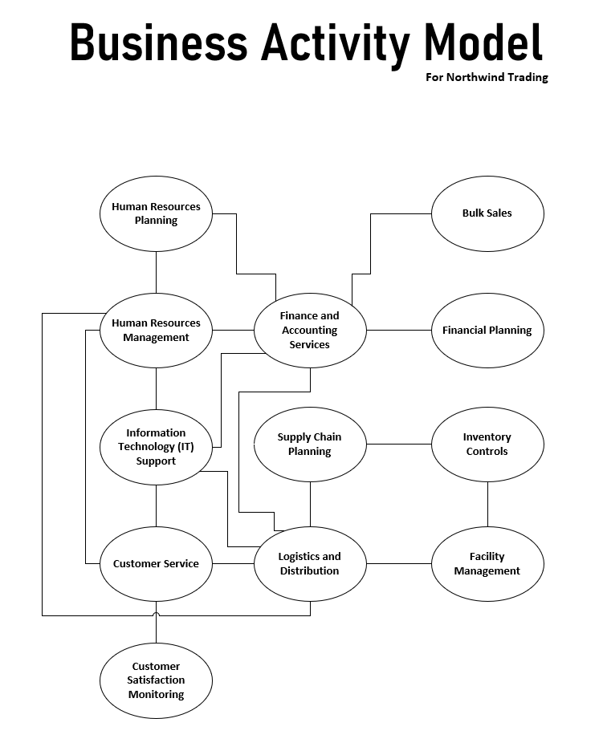
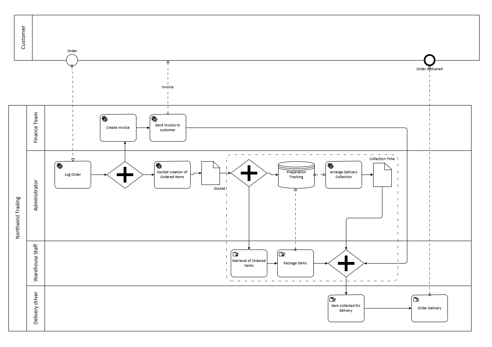

# Business Process Optimization Through BPMN

## Project Overview

This project demonstrates the analysis and optimization of an e-commerce order fulfillment process using **Business Process Model and Notation (BPMN)** and **Microsoft Visio**.

The objective was to analyze an existing sequential fulfillment workflow, identify process inefficiencies, and design an improved future-state process using parallel processing, automation opportunities, and improved coordination between business functions.

A **Business Activity Model (BAM)** was also developed to understand the relationships between key activities across the organization.

---

## Business Problem

The existing order fulfillment process relied heavily on a sequential flow of activities across multiple teams.

The process involved:

- Order processing
- Invoice creation and delivery
- Warehouse docket generation
- Item retrieval and packaging
- Delivery collection scheduling
- Package collection and delivery

Because activities were largely performed one after another, downstream activities had to wait for previous activities to be completed, increasing the overall fulfillment time.

The goal was to redesign the process to reduce unnecessary waiting and improve operational efficiency.

---

## Tools & Techniques

- Microsoft Visio
- Business Process Model and Notation (BPMN)
- Business Activity Modeling (BAM)
- As-Is / To-Be Process Analysis
- Business Process Analysis
- Process Improvement
- Workflow Optimization
- Process Automation Analysis

---

## Business Activity Model

A Business Activity Model was created to map important organizational activities and visualize their relationships across areas including:

- Customer Service
- Finance and Accounting
- Human Resources
- Information Technology
- Supply Chain
- Logistics and Distribution
- Inventory Control
- Facility Management
- Sales

The model provides a high-level view of how supporting, operational, planning, and monitoring activities interact across the organization.

---

## As-Is Process

The **As-Is BPMN model** represents the existing order fulfillment workflow.

The process moves through multiple business functions, including Finance, Administration, Warehouse Operations, and Delivery.

### Key Observation

The workflow is predominantly sequential. Activities such as invoice processing, warehouse preparation, and delivery collection occur in sequence, creating waiting time between different stages of the fulfillment process.

---

## Identified Improvement Opportunities

Analysis of the existing process identified several opportunities for improvement:

- Reduce dependency on strictly sequential processing.
- Perform independent activities simultaneously where possible.
- Automate repetitive administrative activities.
- Improve coordination between warehouse preparation and delivery collection.
- Reduce manual handoffs between departments.
- Track order preparation to support better collection scheduling.

---

## To-Be Process

The **To-Be BPMN model** redesigns the workflow to improve efficiency.

### Key Improvements

**Parallel Processing**

Independent activities are performed concurrently rather than waiting for the completion of unrelated tasks.

This allows financial processing, warehouse activities, and delivery collection planning to progress in parallel where process dependencies allow.

**Process Automation**

Several repetitive activities were identified as candidates for automation, including:

- Invoice creation
- Invoice sending
- Warehouse docket generation
- Delivery collection scheduling

**Preparation Tracking**

Order preparation tracking was introduced to provide better visibility into warehouse progress and support more effective scheduling of delivery collection.

**Reduced Waiting Time**

Parallel execution and automation reduce unnecessary waiting between departments while maintaining the dependencies required for order fulfillment.

---

## As-Is vs To-Be

| As-Is | To-Be |
|---|---|
| Primarily sequential workflow | Parallel processing where possible |
| Manual administrative activities | Automation opportunities identified |
| Collection arranged after preparation | Collection planning supported by preparation tracking |
| Multiple departmental handoffs | Improved coordination between functions |
| Higher potential waiting time | Reduced process delays |

---

## Skills Demonstrated

- Business Analysis
- Business Process Modeling
- BPMN
- Business Activity Modeling
- As-Is / To-Be Analysis
- Business Process Improvement
- Workflow Analysis
- Process Automation Analysis
- Microsoft Visio
- Cross-functional Process Mapping

---

## Key Takeaway

This project demonstrates how business process modeling can be used not only to document an existing workflow, but also to identify inefficiencies and design a more efficient future-state process.

By combining **BPMN, As-Is/To-Be analysis, process automation, and parallel processing**, the redesigned workflow provides a structured approach to reducing order fulfillment delays and improving coordination across business functions.

---

> **Note:** This project is a portfolio case study created for educational purposes. The business scenario is simulated and does not represent client or professional consulting work.